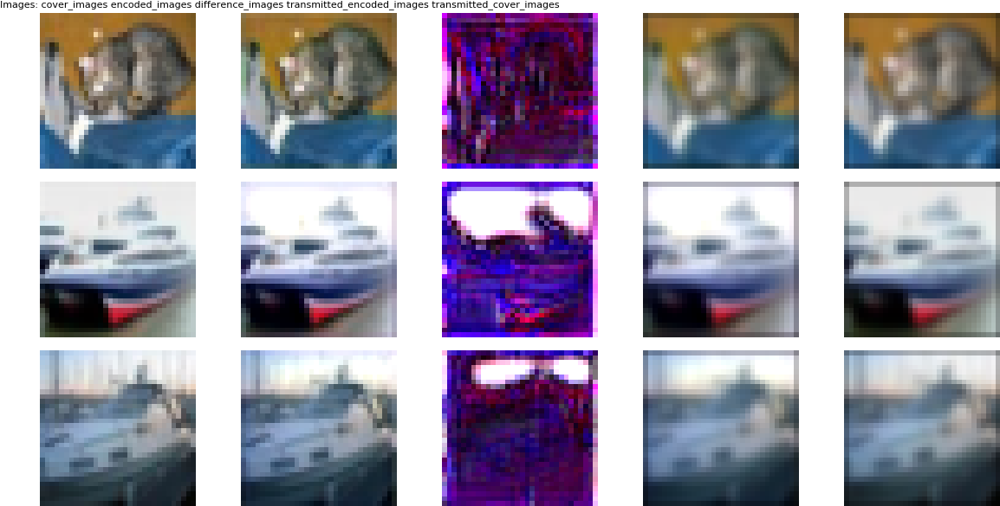
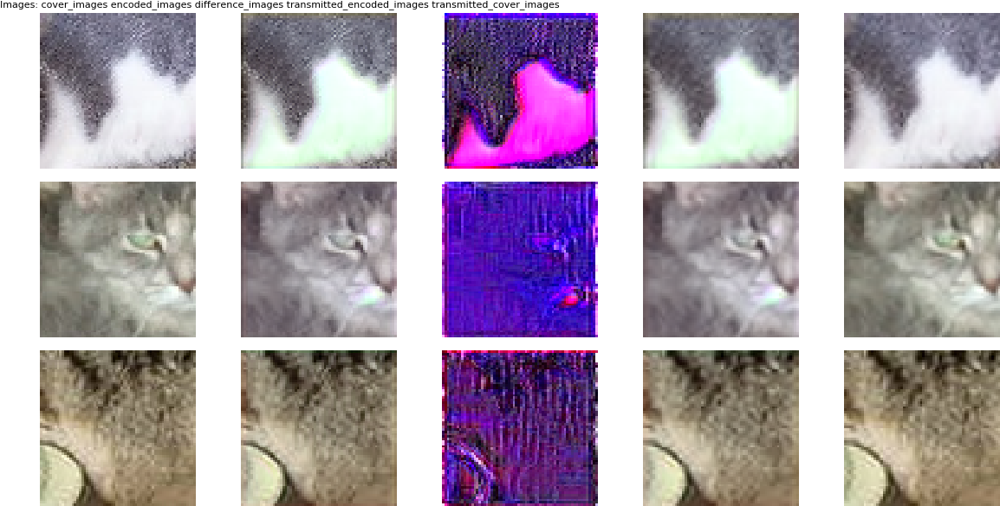

# Implementation of HiDDeN in TensorFlow

Based on [_HiDDeN: Hiding data with deep networks (Zhu et al., 2018)_](https://arxiv.org/pdf/1807.09937)


## Installation

Clone the code and install via:

```
pip install -r requirements.txt
```

## Features

- Noise Layers: identity, gaussian, dropout, crop, cropout, jpeg-mask
- configurable via [cfg.py](cfg.py) and cmd arguments.
- apply on CIFAR10, MNIST or any images stored in a directory


## Terminology

| Name | Comment |
-------|----------|
| Encoder | Encodes Cover Image (adds secret Message to it), produces Encoded Image
| Decoder | Decodes Encoded Image as received by the Transmitter  (produces secret Message)
| Transmitter |  Potentially adds noise to Encoded Image through zero to N parameterless noise layers
| Discriminator | Predicts the probability of an image being an Encoded Image (and not a Cover Image)
| Encoded Image |  Image with encoded secret Message
| Cover Image | Original, unaltered Image
| Message | Binary secret Message of length L 
| Image Distortion Loss |  Distance between Cover Image and Encoded Image
| Adversarial Loss |  Ability of Discriminator to dectect an Encoded Image
| Message Distortion Loss | Distance between original and decoded secret Message
| Discriminator Loss | Ability of Discriminator to recognize Encoded Images (classification loss)
| Transmitted Image | Image that was transmitted and thus was potentially subject to noise

## Examples

### CIFAR10

The following script shows how to train the model with a Gaussian noise layer on the CIFAR10 dataset.

```
DATASET=cifar10
EPOCHS=20
BATCH_SIZE=12
NOISE_LAYERS=gaussian
EXP_ID=gaussian
TO_YUV=0

TBDIR=./tmp_cifar10/tensorboard/${EXP_ID}
PLOTDIR=./tmp_cifar10/plots/${EXP_ID}
CKPTDIR=./tmp_cifar10/ckpts/${EXP_ID}
LOGDIR=./tmp_cifar10/logs/${EXP_ID}


python train.py \
--noise_layers $NOISE_LAYERS \
--dataset $DATASET \
--batch_size $BATCH_SIZE \
--epochs $EPOCHS \
--to_yuv $TO_YUV \
--tbdir $TBDIR \
--plotdir $PLOTDIR \
--ckptdir $CKPTDIR \
--logdir $LOGDIR \
--loss_weight_distortion 10
```



*Figure showing results after running the above example. From left to right column: Cover Image, Encoded Image, Difference Image (magnified), Transmitted Encoded Image, Transmitted Cover Image.*


### Cats and Dogs

The following script shows how to train the model with a JPEG noise layer on images stored in a local directory. The model was trained on 64x64 pixel crops.

```
DATASET=dir
EPOCHS=30
BATCH_SIZE=12
TRAIN_CROP=64
NOISE_LAYERS=jpeg_mask
EXP_ID=jpeg_mask
TO_YUV=1


TBDIR=./tmp_cats_vs_dogs/tensorboard/${EXP_ID}
PLOTDIR=./tmp_cats_vs_dogs/plots/${EXP_ID}
CKPTDIR=./tmp_cats_vs_dogs/ckpts/${EXP_ID}
LOGDIR=./tmp_cats_vs_dogs/logs/${EXP_ID}

TRAIN_DIR="/my_images/train/"
VAL_DIR="/my_images/val/"
TEST_DIR="/my_images/test/"

python train.py \
--noise_layers $NOISE_LAYERS \
--dataset $DATASET \
--batch_size $BATCH_SIZE \
--epochs $EPOCHS \
--to_yuv $TO_YUV \
--tbdir $TBDIR \
--plotdir $PLOTDIR \
--ckptdir $CKPTDIR \
--logdir $LOGDIR \
--loss_weight_distortion 10 \
--train_dir $TRAIN_DIR \
--val_dir $VAL_DIR \
--test_dir $TEST_DIR \
--train_crop $TRAIN_CROP \
--train_crop $TRAIN_CROP \
--train_crop 3
```



*Figure showing results after running the above example. From left to right column: Cover Image, Encoded Image, Difference Image (magnified), Transmitted Encoded Image, Transmitted Cover Image.*

## Tests

```
python -m unittest discover
```